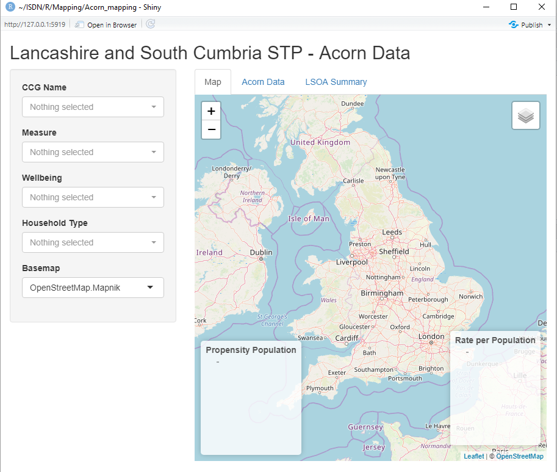
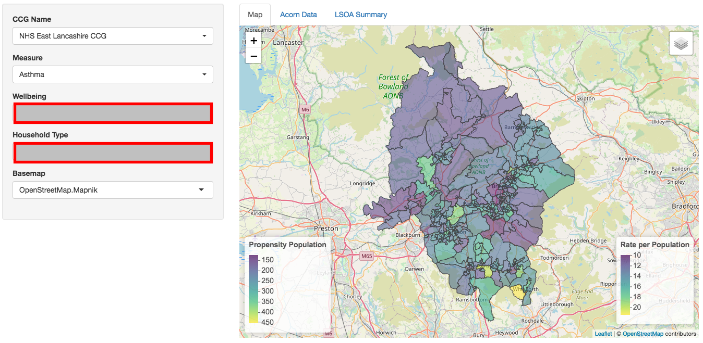

# R Leaflet Mapping

The code included in the 'app' file is an example Shiny appy which uses the package Leaflet to plot UK Lower Layer Super Output Area (LSOA) geographical boundary data by Clinical Commissioning Group. It references an example dataset (not disclosed here). This can be replaced with anything that includes LSOA as a variable.

See 'Leaflet_r_notes.Rmd' for more detailed notes.

The 'app_edit.R' is the latest version of the Shiny app.

Below are screen shots of the (current) final product...

